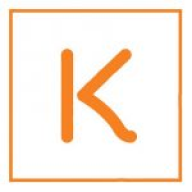

  

  

  <a aria-label="try fortstatus" href="https://koper-test-web.vercel.app/"><b>Try in the Browser</b></a>

## Objective

The objective of the project is to create a web application so that it is possible to play the game "Rock paper scissor lizard spock" based on the series The big bang theory.

### Core

- [Javascript](https://developer.mozilla.org/pt-BR/docs/Web/JavaScript)

### Client

- [React](https://reactjs.org/)
- [Styled Components](https://styled-components.com/)
- [Vercel](https://vercel.com/)

## Getting Started with Create React App

This project was bootstrapped with [Create React App](https://github.com/facebook/create-react-app).

## Available Scripts

In the project directory, you can run:

### `yarn start`

Runs the app in the development mode.\
Open [http://localhost:3000](http://localhost:3000) to view it in the browser.

## Learn More

You can learn more in the [Create React App documentation](https://facebook.github.io/create-react-app/docs/getting-started).

To learn React, check out the [React documentation](https://reactjs.org/).

## Contact

Pierre Boschetto - [Github](https://github.com/PierreBosch) - **[pierre.moota@gmail.com](mailto:pierre.moota@gmail.com)**
